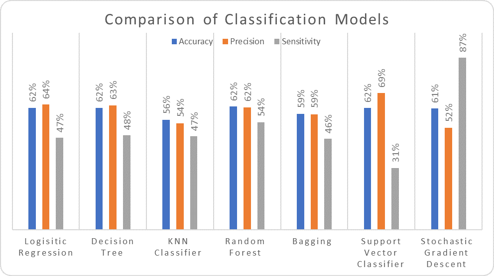

# Hospital Readmission Among Diabetic Patients: Understanding Key Drivers & Identifying High Risk Patients

## Table of Contents 
- [Team Introduction](#team-introduction)
- [Problem Statement](#problem-statement) 
- [Background](#background) 
- [Exploratory Data Analysis](#exploratory-data-analysis)
- [Model Development](#model-development)
- [Executive Summary](#executive-summary) 
- [Use Case Scenario](#use-case-scenario) 
- [Data Acquisition](#data-acquisition) 
- [Required Libraries](#required-libraries) 
- [Supporting Documentation](#supporting-documentation) 
- [Opportunities for Further Improvements](#opportunities-for-further-improvements) 
 
## [Team Introduction](#team-introduction) 
General Assembly's Data Science Immersive Louisville campus  is the sponsor of the project.  The lead modeler of this project is [Navaneet Dutt](https://www.linkedin.com/in/navaneet/). The instructional team, comprising of [Chuck Dye](https://www.linkedin.com/in/gregory-dye/), Alex Zandel, [John Hazard](https://www.linkedin.com/in/jdhazard/) and James Larkin, guided Navaneet Dutt in this initiative.

## [Problem Statement](#problem-statement) 
The objective of this project is to identify patients who a high risk of readmittance to hospital after being released.  The project also identifies the characteristics of patients who were readmitted and those who were not.  In addition, the project provides an activation plan to reach out to the most vulnerable with a success rate higher than the overall model.
## [Background](#background) 
The data was obtained from the Health Facts database compiled by the Cerner Corporation, Kansas City, MO.  The data comprises of clinical care records complied over a period of ten years from 1999-2008 and 130 hospitals and integrated delivery network.  These care institutions varied in bed size with 14 with 500+ beds, 78 with 100-499 beds, 38 with under 100 beds.  These institutions were fairly representative of the US with 18 in the Midwest, 58 in the Northeast, 28 in the South and 16 in the West.
The data comprised of 101,766 encounter records for patients who were diabetic and were provided with diabetic management.  They were admitted to the hospitals for 24 hours or more.  Each record contained 50 features the diabetic encounters, including demographics, diagnoses, medications, number of visits in the year preceding the encounter, and payer information.

The data was downloaded from the [Center for Machine Learning and Intelligent Systems,] (https://archive.ics.uci.edu/ml/datasets/Diabetes+130-US+hospitals+for+years+1999-2008) University of California, Irvine. A [research paper](https://www.ncbi.nlm.nih.gov/pmc/articles/PMC3996476/), based on this dataset examined the impact of HbA1c measurements on readmission.  It needs to be highlighted that the data set for the research paper had additional five features for a total of 55.
This project differs from the prior research as it focuses on identification of high-risk patients and activation strategy to preempt hospitalization and therefore readmittance.
## [Exploratory Data Analysis](#exploratory-data-analysis)

The data set with 50 variables contained two keys – an encounter id which was unique and a patient number.  There were 30,248 duplicate records based on the patient number.  However, they were unique encounters and were not purged from the data set.  The dataset did not contain any NULL values, however there was a high incidence of “?”, ”No” and “None” values.  The resolutions of these values are discussed in the following paragraphs.

### Demographics:
Race, gender and age had a few missing variables while weight had over 96% “?” values and were dropped from the analysis.  Age was in cohorts of 10 from 01-100 and considered categorical.  There were 2,274 encounters with missing gender, age or race and were dropped from the dataset. 
Payer and Medical Specialty:   These two variables had 40% and 49% “?” values and were dropped.
Diagnosis Codes: Each encounter had a maximum of three diagnosis codes indicating the major ailments.  These were ICD-9 codes and each of the fields (diag_1, diag_2, diag_3) had 700-800 distinct values.  These values were rolled up to 9 major ICD-9 disease classification.  A new field, diagnosis count, was created to count the number of diagnosis for each patient encounter.

### Diabetes Medication:  
There were 23 medications as features with three treatment outcomes, if a patient was administered the medication. Two of the medications were not administered to any patient encounter. Eight of the medications were administered to 1% or more patients with insulin being at 53% while the seven others were administered 1%-11% of the patients. There new field – ‘Up’, ‘Down’ and ‘Steady’ – were created that counted the three outcomes of the medications.  The fifteen medications which were administered to less than 1% of the patients, were then dropped from the data set.

### Discharge Disposition: 
Patients who expired in the hospital or were sent for hospice care were dropped from the data set.

### Hg A1c Results: 
Hg A1c was not a standard diabetes metric during the data collection period and only 17% of the encounters had data on this metric.  The analysis wanted to examine if measurement of this biometric had any affect on readmission and were kept in the dataset.

All categorical variables were one hot encoded so that it can be utilized in ML algorithms.  The “eda_diabetes.ipynb” Jupyter Notebook provides the details of the EDA described above.  The data conversions were compiled in “model_inputs.ipynb” Jupyter Notebook for quick conversion and export as “input_file.csv” for use in model development.

## [Model Development](#model-development)

As 21 of the 34 variables in the final data set were categorical, the analysis becomes a classification problem.  

The “model_diabetes.ipynb” Jupyter Notebook contains the codes for the models.  After one-hot encoding, there were 79 independent variables.  A train-test split of 75-25 was undertaken.

Seven different classification models were developed – Logistic Regression, K-means Clustering, Decision Tree, Random Forest, Bagging, Linear Support Vector Classifier and Stochastic Gradient Descend.  A 5-layer neural network analysis was also undertaken.
The Stochastic Grandient Descend model was highly unstable as each run showed a different outcome.  In general, this model classified 80-85% of the test data set as readmits.  The other six models had similar Accuracy and Precision but varying Sensitivity.

 
Though Random Forest had the highest Sensitivity, we choose the Logistic Regression for its simplicity and interpretability.

## [Required Libraries](#required-libraries)

- Python 3.x
- scikit-learn
- TensorFlow

