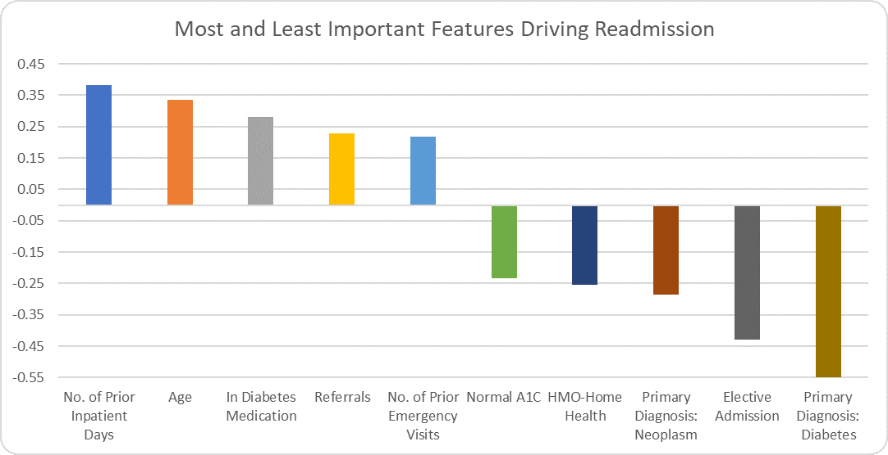
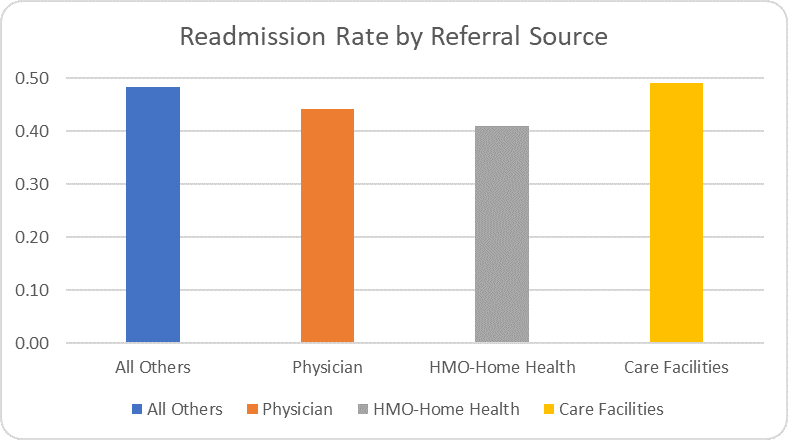
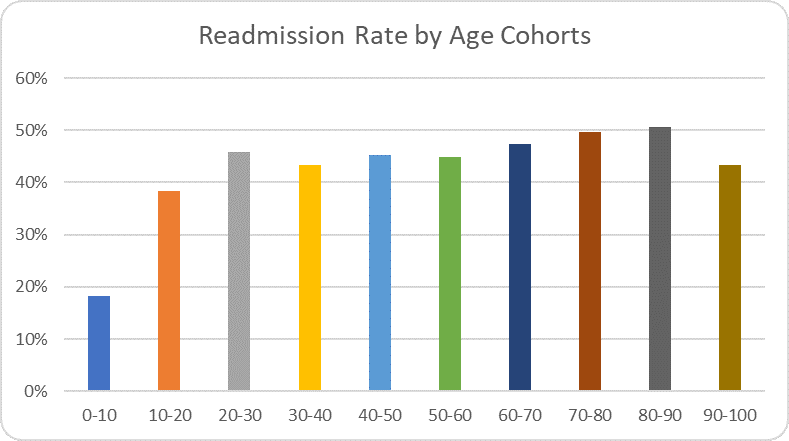
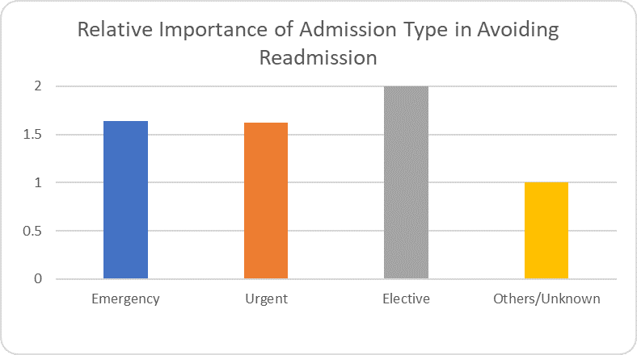
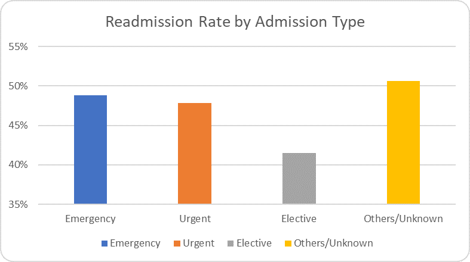
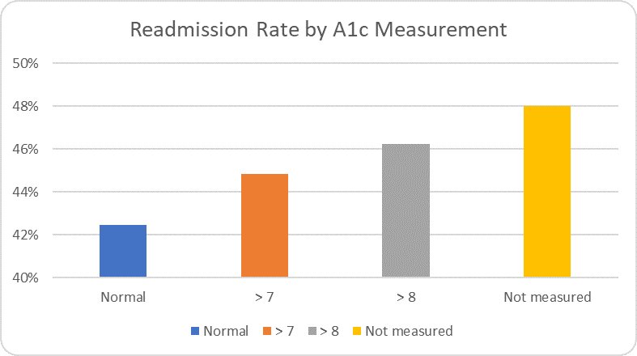
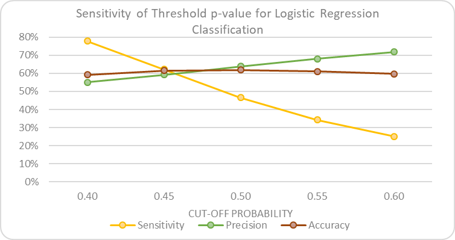

# Hospital Readmission Among Diabetic Patients: Understanding Key Drivers & Identifying High Risk Patients

## Table of Contents 
- [Executive Summary](#executive-summary) 
- [Acknowledgement](#acknowledgement)
- [Problem Statement](#problem-statement) 
- [Background](#background) 
- [Exploratory Data Analysis](#exploratory-data-analysis)
- [Model Development](#model-development)
- [Model Interpretation](#model-interpretation)
- [Sensitivity Analysis](#sensitivity-analysis)
- [Model Activation Strategy](#model-activation-strategy)
- [Opportunities for Further Improvements](#opportunities-for-further-improvements) 
- [Required Libraries](#required-libraries)
 
## [Executive Summary](#executive-summary)

This project analyzed a dataset of US hosptial records over a 10-year period for diabetic patients to predict readmission.  It focuses on identification of high-risk patients and provides an acitvation strategy for intervention to preempt readmittance. The project also identifies the key features of high risk and low risk patients.

## [Acknowledgement](#acknowledgement) 

The author, [Navaneet Dutt](https://www.linkedin.com/in/navaneet/), acknowledges the generosity of General Assembly's Data Science Immersive Louisville campus  and its sponsors, [Humana](http://www.humana.com) and [Microsoft](http://microsoft.com).  The author wishes to thank the instructional team, [Chuck Dye](https://www.linkedin.com/in/gregory-dye/), Alex Zandel, [John Hazard](https://www.linkedin.com/in/jdhazard/) and James Larkin, who provided instructions, encouragement and inspiration during the twelve-week program.

## [Problem Statement](#problem-statement)

The objective of this project is to identify patients who are at a high risk of readmittance to hospital after being released from in-patient stay.  The project also identifies the characteristics of patients who were readmitted and those who were not.  In addition, the project provides an activation plan to reach out to the most vulnerable with a success rate higher than the overall model.

## [Background](#background) 

Hospital readmission is a major drain of health resources and reflects either early discharge or inadequte post discharge care.  The Center for Medicare and Medicaid Services penalizes hopitals for patient readmission.  

The data for this analysis was obtained from the Health Facts database compiled by the Cerner Corporation, Kansas City, MO.  It comprised of clinical care records complied over a period of ten years from 1999-2008 and from 130 hospitals and integrated delivery network.  These care institutions varied in bed size with 14 with 500+ beds, 78 with 100-499 beds, 38 with under 100 beds.  These institutions were fairly representative of the US with 18 in the Midwest, 58 in the Northeast, 28 in the South and 16 in the West.
The data comprised of 101,766 encounter records for patients who were diabetic and were provided with diabetic management.  They were admitted to the hospitals for 24 hours or more.  Each record contained 50 features the diabetic encounters, including demographics, diagnoses, medications, number of visits in the year preceding the encounter, and payer information.

The data was downloaded from the [Center for Machine Learning and Intelligent Systems,](https://archive.ics.uci.edu/ml/datasets/Diabetes+130-US+hospitals+for+years+1999-2008) University of California, Irvine. A [research paper](https://www.ncbi.nlm.nih.gov/pmc/articles/PMC3996476/), based on this dataset examined the impact of HbA1c measurements on readmission.  It needs to be noted that the data set for the research paper had an additional five features for a total of 55.

This project differs from the prior research as it focuses on identification of high-risk patients and provides an activation strategy for outreach to high risk patient to preempt hospitalization readmission.

## [Exploratory Data Analysis](#exploratory-data-analysis)

The data set with 50 variables contained two keys – an encounter id which was unique and a patient number.  There were 30,248 duplicate records based on the patient number.  However, these were unique encounters and were not purged from the data set.  Though dataset did not contain any NULL values, there was a high incidence of “?”, ”No” and “None” values.  The resolution of these values are discussed in the following paragraphs.

**Demographics**
Race, gender and age had a few missing variables while weight had over 96% “?” values and was dropped from the analysis.  Age was available in cohorts of 10 from 00-100 and considered categorical.  There were 2,274 encounters with missing gender, age or race and were dropped from the dataset. 

**Payer and Medical Specialty**
These two variables had 40% and 49% “?” values and were dropped.

**Diagnosis Codes** 
Each encounter had a maximum of three diagnosis codes indicating the major ailments.  Each of the fields (diag_1, diag_2, diag_3) had 700-800 distinct values which were ICD codes.  For the analysis, these values were rolled up to 9 major ICD-9 disease classification.  A new field, diagnosis count, was created to count the number of diagnosis for each patient encounter.

**Diabetes Medication**
There were 23 medications with three treatment outcomes, if a patient was administered the medication. Two of the medications were not administered to any patient encounter. Eight of the medications were administered to 1% or more patients with insulin being administered to 53% of the patient encounters.  Seven others were administered 1%-11% of the patients. In this analysis, three new fields – ‘Up’, ‘Down’ and ‘Steady’ – were created that counted the three outcomes of the medications.  The fifteen medications which were administered to less than 1% of the patients, were then dropped from the data set.

#### Discharge Disposition: 
Patients who expired in the hospital or released for hospice care were dropped from the data set.

#### Hg A1c Results: 
Hg A1c was not a standard diabetes metric during the data collection period and only 17% of the encounters had Hg A1c reported.  The analysis wanted to examine if measurement of this biometric had any affect on readmission and were kept in the dataset.

All categorical variables were one hot encoded so that it can be utilized in the ML algorithms.  The “eda_diabetes.ipynb” Jupyter Notebook provides the details of the EDA described above.  The data was processed in the “model_inputs.ipynb” Jupyter Notebook and exported as “input_file.csv” for use in model development.

## [Model Development](#model-development)

As 21 of the 34 variables in the final data set were categorical, the analysis becomes a classification problem.  

The “model_diabetes.ipynb” Jupyter Notebook contains the codes for the models.  After one-hot encoding, there were 79 independent variables.  A train-test split of 75-25 was undertaken.

Seven different classification models were developed – Logistic Regression, KNN, Decision Tree, Random Forest, Bagging, Linear Support Vector Classifier and Stochastic Gradient Descend.  A 5-layer neural network analysis was also undertaken.

The Stochastic Grandient Descend model was highly unstable as each run showed a different outcome at every run.  The other six models had similar Accuracy and Precision but varying Sensitivity as shown in the chart below.

 
Though Random Forest had the highest Sensitivity, we choose the Logistic Regression for its simplicity and interpretability. 

## [Model Interpretation](#model-interpretation)

The most and the least important patient encounter features that drove readmission are shown in the chart below. The least important features are also the ones that prevent readmission and should be viewed as good-t0-have features among patients.   

### Most Important Features for Readmission

**In-Patient Days and Emergency Visits:** 

The number of prior in-patient days spent in the hospital and number of prior emergency care visits to a hospital in the preceding year were among the top drivers for readmission.  This indicates that these diabetic patients extremely sick.  

**Diabetes Medication:**  

Being on a diabetes medication is a may indicate that the patient is not adequately manage diabetes.  Issues like medication adherence and diabetes management therapies should be fully explored. 

**Referrals:**  

Most of the hospitalization and subsequent readmits are also driven by the type of Referrals with referrals from Physicians and Care Facilities being the Top Drivers.  There are opportunities for care coordination and diabetes management to prevent readmissions.  Readmit rate for both Physician and Care Facilities referrals is higher than HMO/Clinic/Home Health as was their coefficients for the model.

   
**Age:** 

The age cohorts 70-80 is the most vulnerable to readmission followed by 80-90 and 60-70.  Suprisingly, patients in the age group of 90-100 have lower readmission rate and importance rating. The relative importance ratings follow the same pattern as readmit rates that reflects the model’s interpretability power.

 
  

### Least Important Features of Readmission

The least important features are the ones that prevent readmits.

**Primary Diagnosis-- Diabetes:** 

The presence of this diagnosis indicator suggest that co-morbidities have not yet become prominent.  

**Elective Admission:**

Elective admission suggests preventive and cautionary admission and has the highest negative coefficient compared to other admission types.  The readmission rate is also the lowest among admission types suggesting strong interpretability of the model.

 
  

**Hg A1c:** 

The Hg A1c is a test that measures the long-term (2-3 months) blood glucose level unlike serum glucose test which is a spot measure.  Only 17% in the data set have the Hg A1c measure. A score of 7 or below indicates no long-term diabetes while between 7-8 indicates prevalence of diabetes. A score of 8 and above indicates severe diabetes.  Therefore, this indicator as the driver of preventing readmits suggest **absence of diabetes among those identified as diabetic** during hospital admission.

 

  

## [Sensitivity Analysis](#sensitivity-analysis)

The default probability value (p-value) in the Logistic Regression Classification model was set at 0.5.  Changing this threshold changes the Classification Matrix. The chart below shows the sensitivity of changing the threshold p-value. Decreasing the p-value  increases the Sensitivity rapidly and gradually decreases the Precision.  Accuracy remains fairly constand.  In order to identify more True Posititives, the threshold p-value should be decreased. However, it comes at the expense of Predicted Positives as shown in the next chart.  Thus, False Positives also increases.  This compromises the efficacy of activating of the model in real world conditions.

 
 
   
## [Model Activation Strategy](#model-activation-strategy)

Logistic Regression models provides probability of success for every observation.  The analysis for p-value threshold, describe above, demonstrates the inefficiency of such an approach.  Lowering threshold p-value identifies a group of Predicted Positives and provides no guidance on who to prioritize, that is, it is random thereafter.

In real-world, effective activation in form of intervention is constrained by limited resources.   

An efficient strategy for intervention is to rank the patients by their p-value (probability of readmit) rather than segmenting them in the two classes (Predicted Positives and Predicted Negatives) as Classification Matrix does.  The chart below shows segmenting the patient base into ten equal bins, called deciles, based by ranking on their p-value.  A higher decile will have more True Positives than a lower decile
 

Segmenting by deciles provide a business users an easy-to-use segements (deciles) to target based on their capacity and constraints.  The top decile has a higher probability of reaching the Observed Positives.  The Top Decile above has a success rate (Precision) of 76% and the Top 2 Deciles have a cumulative success of 70%.   That is, by targeting the top 20% of the population, 14% of the Observed Positives can be reached. 

The Classification Matrix does not provide any clear and easy to understand strategy for outreach and intervention.  One has to set p-values to reach the target, which is not easy for business users to comprehend.  For example, to reach the target of 14% of the Observed Positives using the Classfication Matrix, one has to set a p value and determine the percentage of Precited Positives to choose at random.  At p =0.4, one needs to reach 38% of the Predict Positives which represents 26% of the total population.  At p =0.55, one needs to reach 86% of the Predicted Positivies which represents 21% of the total population.  

The decile segmentation provides a simple targeting startegy for business to comprehend and deploy.

## [Opportunities for Further Improvements](#opportunities-for-further-improvements) 

The strategy recommended in this project should be tested and the model should be validated with real-world settings.  The lack of biometrics such as weight, blood pressure, serum glucose and Hg A1c yields a model with low accuracy which can be further improved with these metrics.  

## [Required Libraries](#required-libraries)

- Python 3.x
- scikit-learn
- TensorFlow

